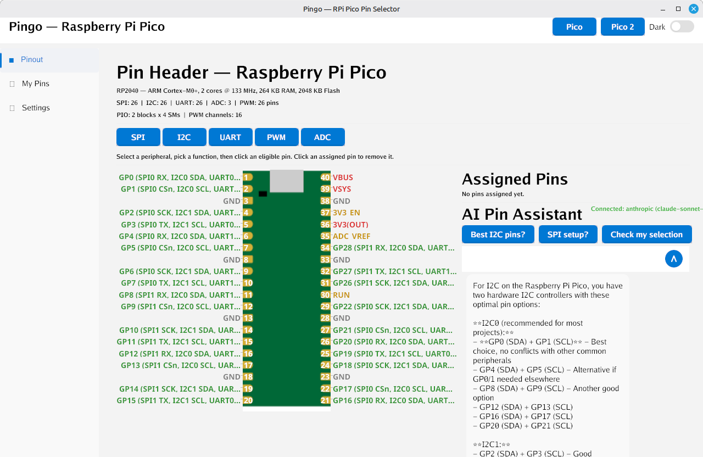
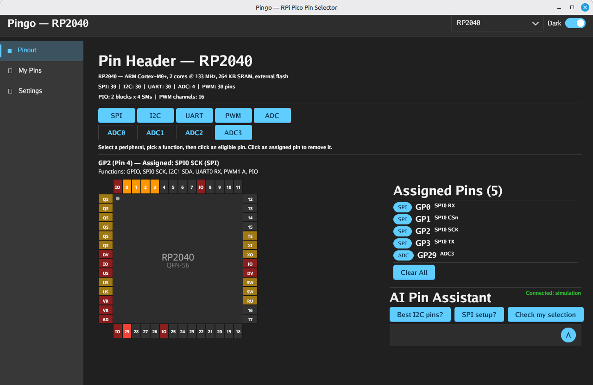

# Pingo



A Raspberry Pi Pico / Pico 2 pin selector desktop application built with [ImmyGo](https://github.com/amken3d/immygo) — designed to showcase the framework's capabilities while being a genuinely useful hardware development tool.

## Features

- **Interactive Pinout Viewer** — Visual SVG-rendered board diagram with the full 40-pin header
- **Bare Chip Support** — Dynamic QFN package rendering for RP2040 (QFN-56), RP2350A (QFN-60), and RP2350B (QFN-80) with all physical pins visible
- **Pin Hover Details** — Hover over any pin (GPIO, power, ground, or special) to see its identity, assignment status, and available functions
- **Pin Selector** — Browse and assign GPIO functions (SPI, I2C, UART, PWM, ADC, PIO) with category filtering
- **Conflict Detection** — Automatically flags when selected peripherals share the same GPIO
- **Board / Chip Switching** — Dropdown selector to switch between Pico, Pico 2, RP2040, RP2350A, and RP2350B instantly
- **AI Assistant** — Built-in chat for pin selection advice, powered by multiple LLM backends (Ollama, Anthropic Claude, Yzma local GGUF)
- **Dark/Light Themes** — Runtime theme switching with ImmyGo's reactive theme system
- **Persistent Settings** — AI provider config saved to `~/.config/pingo/settings.json`

### Bare Chip QFN View



Select a bare chip variant (RP2040, RP2350A, RP2350B) from the dropdown to see its QFN package rendered dynamically with all physical pins — GPIO, power, ground, and special pins like QSPI, USB, and SWD. Hover over any pin for details, click GPIO pins to assign peripheral functions.

## How ImmyGo Is Used

Pingo is structured as a learning guide for [ImmyGo](https://github.com/amken3d/immygo). Each source file demonstrates specific framework concepts, and every file includes detailed header comments explaining the patterns at play.

### Declarative UI with View Trees

ImmyGo apps return a `ui.View` tree from a build function. ImmyGo diffs the tree and only repaints what changed — you never manage draw calls yourself.

```go
ui.Run("Pingo", func() ui.View {
    return ui.VStack(
        ui.AppBar("Title").Actions(ui.Button("Dark"), themeToggle),
        ui.HStack(sideNavView, ui.Flex(1, pageContent())),
    )
}, ui.Size(1280, 800), ui.WithThemeRef(themeRefVal))
```

Layout primitives like `VStack`, `HStack`, `Flex`, `Spacer`, and `Expanded` compose naturally. Modifier chaining via `ui.Style(view).Background(c).Padding(n).Rounded(r)` keeps styling inline.

### Reactive State with `State[T]`

`ui.NewState[T](initial)` creates a generic, thread-safe reactive value. Reading with `.Get()` in the build function and writing with `.Set(v)` automatically triggers a re-render.

```go
var boardChoice = ui.NewState(0)

// In a button handler:
ui.Button("Pico 2").OnClick(func() { boardChoice.Set(1) })

// In the build function — reads the value, ImmyGo tracks the dependency:
spec := currentSpec() // uses boardChoice.Get() internally
```

For map state (like pin selections), always replace the entire map — ImmyGo detects changes by reference, not deep comparison.

### Persistent Widgets

Stateful Gio widgets (`SideNav`, `Toggle`, `Clickable`, `Editor`) track press/release events across frames. If you recreate them every frame, click state is lost. Store them in package-level variables:

```go
// Correct — persists across frames:
var themeToggle = ui.Toggle(false).OnChange(func(on bool) { ... })

// Wrong — would break interactivity:
// toggle := ui.Toggle(false)  // inside a build function
```

This is the single most important rule for interactive ImmyGo apps. Pingo uses this for the `SideNav`, theme toggle, pin clickables, dropdown, sliders, and scroll list.

### Bridging Gio Widgets with `ViewFunc`

When you need a lower-level Gio widget that ImmyGo doesn't wrap declaratively, `ui.ViewFunc` bridges it into the View tree:

```go
sideNavView := ui.ViewFunc(func(gtx layout.Context, th *theme.Theme) layout.Dimensions {
    return sideNav.Layout(gtx, th)
})
```

Pingo uses this for the `SideNav`, the AI `ChatPanel`, and the custom pin diagram renderer.

### Theme Switching

`ui.NewThemeRef()` creates a reactive theme reference. Pass it to `ui.WithThemeRef()` at startup, then swap themes at runtime with `.Set()`:

```go
var themeRefVal = ui.NewThemeRef(theme.FluentLight())

// Toggle dark mode:
themeRefVal.Set(theme.FluentDark())
```

All widgets re-render with the new colors instantly.

### AI Integration

ImmyGo's `ai` package provides a full LLM integration stack. Set up an engine, wrap it in an assistant, and get a ready-made chat UI:

```go
engine = ai.NewEngine(cfg)
assistant = ai.NewAssistant("Pingo", engine)
chatPanel = ai.NewChatPanel(assistant)
```

AI calls block, so run them in goroutines. `chatPanel.SendMessage()` handles the conversation display automatically.

## Lessons Learned

Building Pingo surfaced several practical insights for working with ImmyGo and Gio:

1. **Widget persistence is non-negotiable.** Any widget that tracks user interaction (clicks, toggles, scroll position) *must* live in a package-level variable. Recreating a `widget.Clickable` per frame causes the widget that received mouse-down to be garbage collected before mouse-up — clicks silently fail.

2. **Immutable map updates for state.** `State[T]` detects changes by comparing the value reference. Mutating a map in place won't trigger a re-render. Always create a new map, copy entries, modify, then `.Set()` the new map.

3. **SVG rendering requires a manual pipeline.** Gio has no built-in SVG support. We embed the SVG with `//go:embed`, parse it with `oksvg`, rasterize onto an `image.NRGBA` canvas with `rasterx`, and display it as a bitmap. Rasterizing once at startup at 6x scale keeps it crisp on HiDPI.

4. **Dynamic rendering beats static assets for variable content.** The QFN chip diagrams are drawn dynamically with Gio primitives (`clip.Rect`, `paint.ColorOp`, `op.Offset`) rather than pre-made SVGs. This lets pin colors update in real-time based on selection state and hover, and scales naturally to different pin counts (56/60/80).

5. **Hover with plain variables, not reactive state.** Using `ui.NewState[*Pin]` for hover caused infinite re-render loops — every frame created a new pointer, which ImmyGo saw as a state change. The fix: a plain `var currentHoverPin *Pin` set during diagram layout and read by a `ViewFunc` in the same frame. Gio's `Clickable.Hovered()` only returns true on the frame with the pointer event, so the value persists until the next hover.

6. **`Flex` is essential for scroll regions.** A `ui.Scroll` needs to know its available height. Wrapping the scrollable body in `ui.Flex(1, ...)` gives it "all remaining space" after fixed elements like the AppBar, which enables proper scrolling.

7. **Separate domain logic from UI.** The `pindata/` package has zero UI imports. Board specs, pin definitions, and conflict detection are pure Go — testable and reusable independently of ImmyGo. Peripheral function mapping (SPI, I2C, UART, PWM, ADC) is computed algorithmically from GPIO numbers, matching the RP2040/RP2350 datasheets.

8. **AI calls must be async.** `assistant.Chat()` and `LoadAsync()` block the calling goroutine. Running them on the main thread freezes the UI. Always wrap in `go func() { ... }()`.

9. **Page routing is just a switch.** No router library needed. A package-level `currentPage int` and a `switch` statement in the build function is simple and effective. The `SideNav.WithOnSelect()` callback updates the index.

10. **Settings persistence needs care with secrets.** Non-secret config (provider, model, temperature) is saved to `~/.config/pingo/settings.json`. API keys are *never* written to disk — they're held in memory for the session or read from environment variables.

11. **Reserve fixed space for dynamic content.** The hover detail panel always renders exactly 2 lines regardless of content, using a space placeholder when empty. This prevents layout jumps when hovering between pins with different amounts of information.

## Getting Started

### Prerequisites

**Go 1.24+** is required. Gio also needs platform libraries for window management, input, and GPU drawing.

#### Debian / Ubuntu

```bash
sudo apt install gcc pkg-config libwayland-dev libx11-dev libx11-xcb-dev \
  libxkbcommon-x11-dev libgles2-mesa-dev libegl1-mesa-dev libffi-dev \
  libxcursor-dev libvulkan-dev
```

#### Fedora

```bash
sudo dnf install gcc pkg-config wayland-devel libX11-devel libxkbcommon-x11-devel \
  mesa-libGLES-devel mesa-libEGL-devel libXcursor-devel vulkan-headers
```

#### Arch Linux

```bash
sudo pacman -S gcc pkg-config wayland libx11 libxkbcommon-x11 mesa libxcursor vulkan-headers
```

#### macOS

Xcode command line tools are required. No additional libraries are needed — Gio uses Metal natively.

```bash
xcode-select --install
```

#### Windows

A C compiler is required (e.g. [MSYS2](https://www.msys2.org/) with `mingw-w64-x86_64-gcc`). No additional libraries are needed — Gio uses Direct3D natively.

### Install

```bash
go install github.com/amken3d/Pingo@latest
```

### Run from source

```bash
go run .
```

### Build

```bash
go build .
```

### AI Setup (optional)

The AI assistant auto-detects available providers. To use a specific one:

- **Ollama** — Have Ollama running locally (default `http://localhost:11434`)
- **Anthropic Claude** — Set `ANTHROPIC_API_KEY` environment variable
- **Yzma** — Local GGUF model inference (no external service needed)

Configure providers in the Settings page within the app.

## Project Structure

```
main.go              App entry point, ui.Run, theme, window options
state.go             Reactive state, AI engine, persistent widgets, board switching
layout.go            Main layout: AppBar, SideNav, page routing
page_pinout.go       Pinout viewer, QFN chip diagram, pin selector, hover details, AI chat
page_mypins.go       Selected pins summary with conflict detection
page_settings.go     AI provider & app settings
svg.go               Embedding & rasterizing SVG assets
config.go            Settings persistence
pindata/
  pindata.go         Board specs, pin definitions, categories, conflict detection
  rp_chips.go        Full QFN pinouts for RP2040, RP2350A, RP2350B with algorithmic peripheral mapping
assets/
  pico.svg           Pico/Pico 2 board SVG (from tinygo-org/playground)
  qfn56/60/80.svg    QFN package reference SVGs
```

## License

See [LICENSE](LICENSE) for details.

## Development Notes
This project was built with significant AI assistance (primarily Claude by Anthropic) for code generation, documentation, and scaffolding. Architecture, design decisions, hardware domain knowledge, and review are my own. I’m a solo founder shipping across embedded hardware, firmware, and desktop software — AI-assisted development is core to how I work at that breadth.
